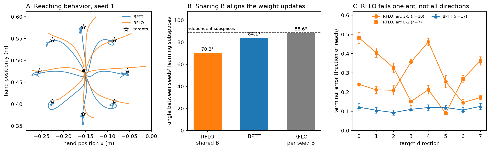

# Comparing BPTT and RFLO Learning Dynamics in Motor Control

Two recurrent networks learn the same center-out reaching task, one with
**backpropagation through time** and one with **RFLO** (Random Feedback Local Online
learning; [Murray, _eLife_ 2019](https://elifesciences.org/articles/43299)), which replaces
the transported gradient with a fixed random feedback matrix `B` and local eligibility
traces. Both drive [MotorNet](https://github.com/OlivierCodol/MotorNet) effectors: a planar
point mass with four Cartesian actuators, and a two-joint arm with six Hill-type muscles.
The question is what the learning rule does to the _set_ of solutions. If credit is assigned
through one fixed random projection, do independently initialized networks end up in the
same corner of solution space, while exact gradients let them scatter?

This project started as a [Neuromatch Academy](https://academy.neuromatch.io/) project.

## Authors

- **Timothy Ho**
- **Victoria Pierce**
- **Chirag Vaswani**

---

## Preliminary results



Arm, 17 seeds that converged in every condition, lr 0.025, 40k steps, 64 units.

**Sharing one feedback matrix aligns the weight updates.** Each seed's recurrent weight
trajectory has a learning subspace: the top-3 directions its weights actually moved along.
Between two RFLO seeds that share `B`, those subspaces sit 70.3° apart. Between two BPTT
seeds, 84.1°. Two independent 3-dimensional subspaces of a 4096-dimensional space are 88.7°
apart, so BPTT seeds are nearly as unrelated as random ones and RFLO seeds are not
(paired permutation over seeds, p = 1.5e-5).

**The alignment comes from sharing `B`, and not from RFLO's locality.** Give each RFLO seed its own
feedback matrix and the angle returns to 88.6°, the random value, with everything else
held fixed (p = 1.5e-5). A second, independent weight metric agrees: seeds sharing `B`
move their weights along directions with a mean pairwise cosine of 0.40, spread over an
effective 4.8 of 17 dimensions, against a chance cosine of 0.016. The paired difference
against per-seed `B` is 0.387 (Holm-corrected p = 3.1e-5 over the two contrasts).

**Function space and behavior lean the same way.** Activation-space
DSA distance between seeds is 0.047 with a shared `B` against 0.069 with per-seed `B`, and
the across-seed spread of the reach profile is 0.785 against 0.845. Neither reaches
significance under the paired null (p = 0.075 and 0.097). Additional analysis is planned comparing
untrained networks.

**RFLO's arm deficit is not uniform.** Panel C: each RFLO seed fails one of two
opposing arcs of the target ring and handles the other, splitting 10 to 7 across seeds, while
BPTT stays flat at 0.11 of reach in every direction. This rules out the reading that RFLO simply
undertrains. Which arc a seed fails depends on both its initialization and its `B`: swapping
`B` at a fixed initialization flips the arc for 7 of 17 networks.

**The point mass as a negative control.** At a shared learning rate of 0.01 the two rules
land within 1.3% and 2.0% of reach distance of the target (15 seeds each), a gap well
inside the 5% equivalence margin, and every run finishes within 10% of reach on every
direction. At that matched behavior the weight geometry shows no corridor: RFLO seeds sit
86.5° apart against BPTT's 88.5° and a null of 88.7°, with a participation ratio of 14.4
out of 15 across-seed directions.

**Training stability.** A shared `B` also makes RFLO easier to optimize: 24 of 26 arm seeds
converged with a shared `B` against 20 of 26 with per-seed `B`, and 26 of 26 for BPTT.

### Notes

Hidden units have no canonical ordering, so cross-seed weight comparisons mix real geometry
with relabeling. Every weight claim here is made in the paired frame, where the two runs of
a seed share an initialization. MotorNet is closed-loop, so hidden-state trajectories are
partly driven by sensory input and not purely intrinsic dynamics. Raw DSA distances are
small fractions of the metric's [0, π] range and are read against anchors (a time-shuffled
surrogate sits at 0.245, networks trained on the other effector at 0.052), not in absolute
terms.

---

## Setup

```bash
conda create -n neuromatch python=3.11
conda activate neuromatch
pip install torch numpy scipy matplotlib seaborn scikit-learn
pip install dsa-metric
```

The `CenterOutReach` environment lives on a fork of MotorNet (branch
[`center-out-reach`](https://github.com/syntactic/MotorNet/tree/center-out-reach)), to be
submitted upstream:

```bash
git clone -b center-out-reach https://github.com/syntactic/MotorNet.git
pip install -e ./MotorNet
```

Run `pytest` from the repository root to check the trainers and the analysis math.

---

## Running experiments

`run_experiment.py` trains one or more seeds and writes a self-describing `.pt` artifact per
(effector, seed, rule), recording its own learning rate, width, feedback-matrix setting and
noise levels:

```bash
python run_experiment.py RigidTendonArm26 --seeds 0 1 2 --lr 0.025 \
    --num-steps 40000 --rule rflo --b-seed 0 --output-dir results/evaryB_fixB
```

The scripts behind the results above are in `drivers/`. Each runs one seed per process,
throttles to `MAX` concurrent jobs, skips artifacts already on disk (so an interrupted
campaign resumes by relaunching), and takes its parameters from environment variables:

| driver                 | what it runs                                                                                                                         |
| ---------------------- | ------------------------------------------------------------------------------------------------------------------------------------ |
| `evaryB.sh`            | RFLO on the arm twice, once with a shared feedback matrix and once with a per-seed one.                                              |
| `arm_bptt.sh`          | BPTT on the arm at the matched rate and budget. Seed _s_ starts from the same initialization as RFLO seed _s_.                       |
| `lr_sweep.sh`          | Learning-rate sweep for either effector, both rules. The point mass matches at 0.01 and the arm does not match at any rate.          |
| `pointmass_matched.sh` | Point mass, 15 seeds at lr 0.01 with weight history: the matched-behavior negative control.                                          |
| `arm_lift.sh`          | Attempts to lift RFLO's arm plateau: wider networks, a terminal-weighted loss, and a sweep of `B` at one fixed network.              |
| `alignedB.sh`          | RFLO with the random feedback matrix replaced by the live readout weights, testing whether the corridor needs feedback to be random. |
| `fixnet.sh`            | One fixed network, many feedback matrices. Separates `B`'s effect on the reach profile from the initialization's.                    |
| `noisy.sh`             | Proprioceptive and visual feedback noise during training, scaled to each effector's reach distance.                                  |

```bash
# 15 seeds, both feedback conditions, with weight history (~0.66 GB per seed)
WEIGHT_HISTORY=1 SEEDS="0 1 2 3 4" nohup bash drivers/evaryB.sh &>logs/evaryB/driver.log &

These are the parameters that worked for me on my Macbook Air M3. A better computer would probably be able to run more concurrent processes. I have tested this on Linux and also with GPUs but the RNGs are hardware-specific so comparisons are best done between runs generated by the same machine.
```

---

## Analysis

Getting all runs to the same behavioral performance (and ideally solving the task) is a prereq for the analysis.
The below script checks that training loss has both
flattened and landed below an absolute bound, since a run can stall in a failed basin and
still look converged by a slope test:

```bash
python check_convergence.py --dir results/evaryB_fixB_wh --rule RFLO
```

Then, by channel:

```bash
# behavior: per-direction terminal error, as a fraction of reach distance
python per_direction_error.py --dir results/evaryB_fixB_wh --rules RFLO --seeds 1 3 4 --per-seed
python summarize_behavior.py --dir results/pm_lr0.01_N15 --n-seeds 15

# activation space: DSA over hidden-state trajectories
python run_activation_dsa.py RigidTendonArm26 --results-dir results/clean \
    --seeds 0 1 2 3 4 5 6 7 8 9 10 11 12 13 14

# weight space: learning-subspace angles and weight-displacement geometry
python run_subspace_geometry.py RigidTendonArm26 \
    --condition fixB=results/evaryB_fixB_wh=RFLO \
    --condition varyB=results/evaryB_varyB_wh=RFLO \
    --condition BPTT=results/arm_bptt_40k_wh \
    --contrast varyB-vs-fixB --contrast BPTT-vs-fixB \
    --seeds 1 3 4 5 8 9 10 11 12 14 18 19 20 21 22 23 24
python delta_w_geometry.py --dir results/evaryB_fixB_wh --effector RigidTendonArm26 \
    --rules RFLO --seeds 1 3 4 5 8 9 10 11 12 14 18 19 20 21 22 23 24

# significance for a family of contrasts, Holm-corrected
python run_paired_permutation.py --cell RigidTendonArm26 \
    results/clean/RigidTendonArm26_activation_dsa_matrix.npy \
    BPTT=results/clean RFLO=results/clean

# the README figure
python make_readme_figure.py
```

Two runs of the same seed share an initialization and a target stream, so they are not
freely exchangeable. Every test permutes the condition label within a seed rather than
shuffling labels across seeds, and a family of tests is Holm-corrected.

---

## Repository layout

```text
├── rnn.py                    # LeakyRNN, with per-step outputs for RFLO's traces
├── trainers.py               # BaseTrainer, BPTTTrainer, RFLOTrainer
├── analysis/                 # library, split by measurement channel
│   ├── io.py                 #   artifact loading, per-direction reshaping
│   ├── behavior.py           #   reach metrics
│   ├── activation.py         #   hidden-state PCA and DSA
│   ├── weights.py            #   weight-displacement and subspace geometry
│   └── stats.py              #   grouped dispersion, permutation tests, Holm
├── plot.py                   # trajectory and workspace plotting
├── drivers/                  # training campaigns (see the table above)
├── run_experiment.py         # train one or more seeds, write artifacts
├── check_convergence.py      # the convergence gate
├── per_direction_error.py    # per-direction reach error
├── summarize_behavior.py     # reach-relative error and scaled success
├── run_activation_dsa.py# activation-space DSA at N=15
├── run_subspace_geometry.py  # learning-subspace (Grassmann) geometry
├── delta_w_geometry.py       # weight-displacement cosine and participation ratio
├── run_paired_permutation.py # paired permutation tests with Holm correction
├── make_readme_figure.py     # the figure above
└── tests/                    # pytest suite
```

---

## Conventions

- Conditions are separated by output directory (`results/clean`, `results/evaryB_fixB_wh`). Filenames stay keyed on effector, seed and rule and the rest lives in the artifact's metadata.
- `--b-seed 0` gives every RFLO run the same feedback matrix; `--b-seed match` draws a new
  one per network seed. BPTT has no feedback matrix, so every `B` experiment is RFLO-only
  and doubles half the runs.
- Weight history is a full recurrent weight matrix per step, about 0.66 GB per arm seed at
  40k steps. Use `--no-weight-history` for anything that only needs behavior or hidden states.
- BPTT and RFLO share an initialization within a seed, by deep copy. Both use plain SGD;
  swapping in Adam for BPTT would break the comparison.
- Noise levels are relative to each effector's reach distance (0.1 m for the arm, 0.5 in the
  point mass's dimensionless box). A shared absolute value would be a different perturbation
  for each.
- Evaluation rollouts are deterministic even when training is noisy: MotorNet's
  `deterministic` flag does not gate the proprioceptive and visual channels, so the trainer
  zeroes those on its own evaluation environment.

---

## References

- Murray, J. M. (2019). Local online learning in recurrent networks with random feedback. _eLife_, 8, e43299.
- Codol, O., Michaels, J. A., Kashefi, M., Pruszynski, J. A., & Gribble, P. L. (2024). MotorNet: a Python toolbox for controlling biomechanical models with artificial neural networks. _eLife_, 13, RP98044.
- Ostrow, M., Eisen, A., Kozachkov, L., & Fiete, I. (2023). Beyond geometry: comparing the temporal structure of computation in neural circuits with dynamical similarity analysis. _NeurIPS_.
- Lillicrap, T. P., Cownden, D., Tweed, D. B., & Akerman, C. J. (2016). Random synaptic feedback weights support error backpropagation for deep learning. _Nature Communications_, 7, 13276.
